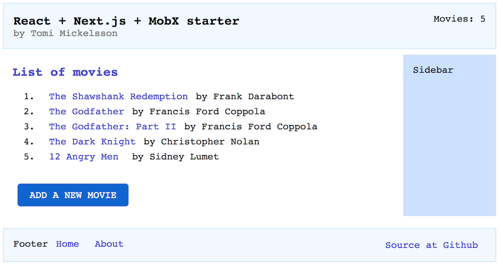

This is my minimal yet functional React starter kit and demo app as of
August 2018.

If you feel tired of Javascript fatigue, and want to get started quick and
easy, take a peek of this.  Developing a modern SPA React app does not get
much simpler than this.


LIVE DEMO [nextjs.tomicloud.com](https://nextjs.tomicloud.com)
-------------------------------------------------



The demo app is a static site, a basic single-page-app that has a few
addressable pages that are lazy loaded on-demand. It demonstrates basic CRUD
operations: 1) list movies, 2) view movie details, 3) create/edit and 4)
delete a movie.

The demo uses browser localStorage for the data storage, which means it runs
without a backend.  The sources do contain a module that does real AJAX calls
to a REST backend - you just need to enable the module and write a server,
and you are in good track to have a real web app. I have developed
[RESTPie3 Python REST API server](https://github.com/tomimick/restpie3) which
implements this simple movie API as an example.


Building blocks
---------------

The demo app consists of a simple but powerful tech stack that provides the
essential functionality for creating modern web apps. It stands on the
shoulders of a few great libraries:

* [React](https://reactjs.org/) is the foundation Javascript library that the
  world raves about
* [Nextjs](https://nextjs.org/) is a lightweight Javascript framework for
  building React apps quickly
* [MobX](https://mobx.js.org/) is a quick and easy state management library
* [SASS](https://sass-lang.com/) is the good old CSS extension language that
  still does the job fine
* [Axios](https://github.com/axios/axios) is a popular AJAX library based on
  Promises

Source tree
-----------

```
├── /components/                # React components used by pages
│   └── /MyHeader.js            # Site header component, just as an example
├── /pages/                     # pages
│   ├── /_app.jsx               # top level layout of the app, loaded once
│   ├── /about.jsx              # about page
│   ├── /index.jsx              # home page, lists movies
│   ├── /moviedetails.jsx       # details page, views a movie
│   └── /movieedit.jsx          # edit page, edits a movie
├── /static/                    # static assets, accessed/exported as is
│   ├── /favicon.ico            # favicon
│   └── /exampledata/
│       └── /movies.json        # sample list of 4 movies - loaded initially
├── /styles/                    # global SASS files
│   └── /layout.sass            # main layout
├── config.js                   # app config, select ajax or localstorage
├── next.config.js              # nextjs configuration, almost empty
├── package-lock.json           # npm something
├── package.json                # list of npm packages required
├── README.md                   # this doc
├── serverapi_ajax.js           # API, talks AJAX to a real backend
├── serverapi_localstorage.js   # API, talks to localStorage
└── store.js                    # data store, managed by MobX
```

Local development
-----------------

Here's how to run the starter in your local machine:

```shell
$ git clone https://github.com/tomimick/tm-nextjs-starter
$ cd tm-nextjs-starter
$ npm install
$ npm run dev
```

Then point your browser to http://localhost:3000.

When any of the dependant files is modified, the changes are hot loaded and
become visible instantly. Enjoy the dev!


Next.js
-------

[Nextjs](https://nextjs.org/) is a great framework that brings the right
amount of order to the chaotic realm of Javascript development. It makes the
start of React development easy by taking care of the configurations and
tooling, letting you focus on the core app right from the start. It provides a
well engineered minimal core functionality that is practically needed by all
web apps.

Next.js benefits in a nutshell:

* Minimum configuration - no need to tinker with webpack or babel configs,
  unless you want
* Enforces structure to the source files - filesystem is the api
* Hot reloading of pages to speedup the dev work
* Built-in SPA routing logic
* Automatic code splitting of pages (provided by Webpack)
* Deployment options: export a static server-less site or run Node.js in the
  backend

Nextjs is mature enough, was released around 2 years ago, and has a healthy
plugin ecosystem. Webpack is used for the ground work.

It is perfectly possible and likely that Nextjs gets replaced or merged with
something even better in the future, but it does encapsulate a few best
practices now that makes it worth trying out.


MobX state management
---------------------

[Redux](https://redux.js.org/) is usually the first-stop as a state management
solution for React apps. It was one the early libraries available, is talked
about in so many blogs and has thus gained almost a standard status.

I've had mixed feelings about Redux from the first encounter. I always like to
think and do research on my own and after reading many React+Redux code bases,
evaluating other options, I think that Redux with its functional and pure
paradigm feels a bit abstract and over-engineered to me.  (Plus Redux is
also used in places where it simply is not needed. Too easy to go over-board.)

In my opinion, MobX offers a simpler and more practical solution to state
management than Redux. It is easier to pick up and understand. It requires
less boilerplate code. You have your state that you declare observable, then
simply mutate your state and all observers are automatically updated. MobX
works and stays out of the way.

Engineers do argue whether Redux is better for a bigger app or for a "real"
app, but it's a never-ending battle. My strategy usually is to keep my code
lean and mean, not even trying to grow a "big" app in the first place...


CSS
---

Nextjs provides support for both site global and page local CSS style sheets.

* A single global CSS file is processed and built from source SASS files, and
  then linked to the app in the HTML with a regular link-tag, and loaded once
  at the start of the app. Proven, solid and with best performance - you do
  not need to put all CSS in JS!
* Page local styles are loaded on-demand along with the page, and written in
  the page component inside ```style jsx``` -tags (see
  [about.jsx](pages/about.jsx) for example).

In this demo I also experiment with [CSS grid](https://learncssgrid.com/)
functionality which is a recent web layout standard. CSS grid is a powerful
layout tool that finally provides a robust way to define a two-dimensional
grid. It will change the way we build layouts. If you have not yet learned or
read about the CSS grid, 2018 is a good time to do it. The browser support is
already very good. It will become mainstream soon.


Generating a static site
------------------------

The ability to generate a static site with Nextjs is an important tool which
makes it possible to run apps without a backend server. You can export the
site to [GitHub pages](https://pages.github.com/),
[Netlify](http://netlify.com) or Amazon S3. (But check a few gotchas with
site+link prefixes with Github pages.)

Another win of static generation is to be able to hook up the app with any
REST backend no matter what is the language of the backend. Clean separation of
frontend and backend also provides modularization at tech level and possibly
at team level.

One note about SEO: to export static versions of the pages with dynamic data,
you would need to script all of the pages in the next.config.js configuration,
[see this example](https://github.com/zeit/next.js/tree/canary/examples/with-static-export).

To generate a static site, simply run

```shell
$ npm run export
```

And the static files will be generated in the ```out```-folder.

To test the static site locally via a local www-server, I quickly run a
python script: (python3 -m http.server)

```shell
$ npm run pyserve
```

And then test the site at http://localhost:8000.

### Size of Javascript

The size of the home page is decent, **about 94KB minified and gzipped**.

The browser loads the home page with a total of 6 requests, and each new page
that is loaded on-demand makes a single js request *once* (remember with React
its all about Javascript, not HTML).

```shell
Page Size Inspector Report
URL: https://nextjs.tomicloud.com/

REQUEST                                       REQ     BYTES

TOTAL___________________________________________6____94,159

Document________________________________________1_______916
-nextjs.tomicloud.com/                                  916

Script__________________________________________4____92,836
-nextjs.tomicloud.com/_next.../index.js               1,053
-nextjs.tomicloud.com/_next/.../_app.js               2,506
-nextjs.tomicloud.com/_nex.../_error.js               2,490
-nextjs.tomicloud.com/.../main-6a4a..js              86,787

Stylesheet______________________________________1_______407
-nextjs.tomicloud.com/_nex.../style.css                 407
```

(Report by my Chrome extension [Page Size Inspector](https://chrome.google.com/webstore/detail/oepnndnpjiahgkljgbohnnccmokgcoln).)


Need help?
----------

Go ahead and take this React starter and perhaps my [RESTPie3 Python REST API
server](https://github.com/tomimick/restpie3) too and build your great
service.

You can also [contact me](mailto:tomi.mickelsson@gmail.com) to ask if I am
available for freelancing work.

Vue version
-----------

If you prefer Vue over React, I have also coded this same starter with [Vue Nuxtjs](https://github.com/tomimick/tm-nuxtjs-starter).

License
-------
MIT License

